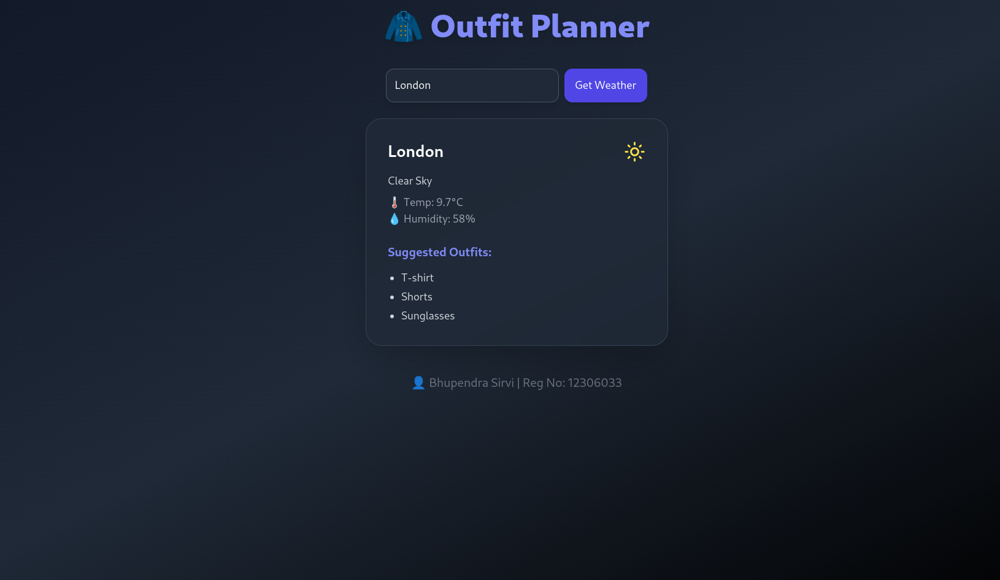

# 🧥 Outfit Planner

A stylish and intelligent outfit recommendation React app based on real-time weather data. Built with ❤️ by **Bhupendra Sirvi (Reg No: 12306033)**.




## 🚀 Features

- 🌦️ Fetches live weather data using the **OpenWeatherMap API**
- 👕 Suggests outfit ideas tailored to weather conditions
- 🎨 Sexy dark-themed UI with beautiful animations
- ⚛️ Built with **React**, **TailwindCSS**, and **Framer Motion**
- 💡 Super lightweight, single-page app with frontend-only logic

---

## 📸 Demo

> Coming soon... or host it on [Vercel](https://vercel.com) / [Netlify](https://netlify.com) to share with friends!

---

## 🛠️ Tech Stack

- **React** – Frontend UI Library
- **TailwindCSS** – Styling with utility-first CSS
- **Framer Motion** – Animations and transitions
- **Lucide Icons** – Beautiful weather icons
- **OpenWeatherMap API** – Real-time weather data

---

## 🔧 Installation

```bash
git clone https://github.com/Satyam00915/Outfit-Planner.git
cd outfit-planner
npm install
npm run dev
